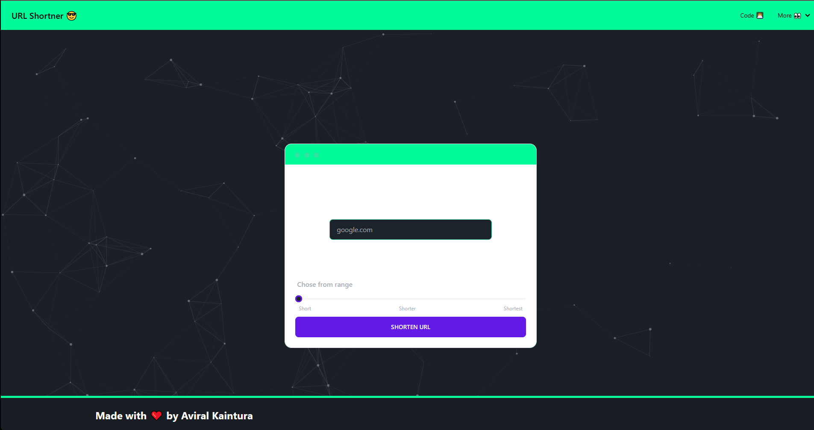
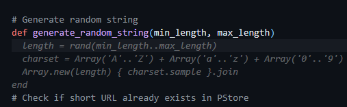
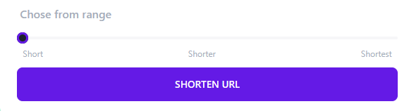

# URL Shortner

A simple yet powerful URL shortening service built with Ruby and the Sinatra framework.   
Check it out here :
https://url-shortner-y7d0.onrender.com/


## Deploy
```
bundle install
ruby app.rb
```

## Demonstration Video
[](https://www.youtube.com/watch?v=COBxOUanI-I)
## How Co-Pilot helped me
- It autocompleted boilerplate codes which saved a lot of time
- Gave me effient way to make the route and database logic in ruby
- helped me in generating some functions like this
  
## Key Features
- Unique shortened links   

- Customizable link length  
- Easy sharing   
- Simple, clean interface
- Flexible deployment

## How It Works
The app was built using:
- Ruby 2.7+
- The Sinatra framework    
- Data storage with PStore
- HTML/CSS interface with daisyUI

Users can:  
- Enter a long URL  
    
- Choose the shortened link length
- Get a shortened URL output in a button  

The app provides:
- Unique, customized shortened links    
- A simple user experience   
- An easily deployable Ruby/Sinatra architecture

The focus was on building an app that is:
- Clean and minimal design   
- Optimized Ruby/Sinatra code      
- Flexible link length and deployment

